# Crypto HFT Anomaly Game - Implementation Plan

A dual-layer game combining a **Stock Market/Crypto Simulation** with a **"Spot the Anomaly"** mechanic.
*Hackathon Context: We are using the **Tambo.co SDK** as the core engine. Anomalies are generated by the AI agent dynamically swapping components in response to game state.*

## Tech Stack
- **Tambo SDK** (`@tambo-ai/react`): The core "Game Master" that controls the UI.
- **React + Next.js**: Application framework.
- **Recharts**: For crypto price visualization.

## Proposed Architecture Logic

### 1. The Market Engine (The "Normal" State)
- **State**: `prices` (simulated using **Perlin Noise** for smooth trends), `balance`, `inventory`.
- **UI Layout**:
    - **Global HUD**: Always visible header/sidebar showing Balance, P&L, Units held.
    - **Crypto Tabs (x4)**:
        - Components: `Chart` (Green/Red trend slope coloring), `BuyButton`, `SellButton`.
    - *(Removed System Log Sidebar per user request)*

### 2. The Anomaly Engine (The "Tambo Agent")
- **Concept**: A "System Agent" running in the background via Tambo SDK.
- **Hide & Seek**: The Chat UI is hidden. The player only sees the *effects* (glitches).
- **Mechanism**:
    - **Trigger**: The Game Loop sends hidden prompts to the Tambo Agent.
    - **Response**: Agent returns a specific Glitch Component.

### 3. Progression & Difficulty System
The game gets harder as `gameTime` increases.
- **Phase 1: Stable (0-30s)**:
    - No anomalies. Learning phase.
- **Phase 2: Visual Glitches (30-90s)**:
    - Anomalies: `Typo`, `Jitter`.
    - Frequency: Low.
    - Impact: Distraction only.
- **Phase 3: System Integerty Failure (90s+)**:
    - Anomalies: `RedButton` (Confusing colors), `ReverseButton` (Buy executes Sell!), `GhostButton` (Disappears).
    - Frequency: High.
    - Impact: Direct gameplay sabotage.

### 4. Anomaly Component Tree
A hierarchical view of the system's corruption paths. Each "Root" is a standard component that can be replaced by any of its "Branches" based on the corruption level.

```mermaid
graph LR
    Buy["🟢 Standard<br/>Buy Button"]
    Sell["🔴 Standard<br/>Sell Button"]
    Graph["📊 Standard<br/>Crypto Chart"]

    Buy --> BuyRed["🔴 Red<br/>Danger Color"]
    Buy --> BuyTypo["📝 Typo<br/>Bad Font"]
    Buy --> BuyJitter["⚡ Jitter<br/>Shaking"]
    Buy --> BuyGhost["👻 Ghost<br/>Disappears"]
    Buy --> BuyBounce["🏀 Bounce<br/>Moves Away"]
    Buy --> BuyRev["🔄 Reverse<br/>Executes SELL"]

    Sell --> SellGreen["🟢 Green<br/>Safe Color"]
    Sell --> SellTypo["📝 Typo<br/>Bad Font"]
    Sell --> SellRev["🔄 Reverse<br/>Executes BUY"]

    Graph --> GNoAxis["❌ NoAxis<br/>No Labels"]
    Graph --> GNoGrid["⬜ NoGrid<br/>No Depth"]
    Graph --> GNeon["💜 Neon<br/>Neon Color"]
    Graph --> GFlat["📉 Flatline<br/>Fake Crash"]

    style Buy fill:#22c55e,stroke:#16a34a,color:#000
    style Sell fill:#ef4444,stroke:#dc2626,color:#fff
    style Graph fill:#3b82f6,stroke:#2563eb,color:#fff
    
    style BuyRev fill:#fbbf24,stroke:#f59e0b,color:#000
    style SellRev fill:#fbbf24,stroke:#f59e0b,color:#000
```



### 5. Advanced Anomalies (New)
To be implemented after core loop verification.
- **Movement Anomalies**:
    - `GlitchBuyButton_Bounce`: A button that physically moves/bounces around its container or the screen, making it hard to click.
- **Sell Button Variants**:
    - Mirroring the Buy Button glitches (`Red`, `Typo`, `Reverse` -> buys instead of sells).
- **Graph Anomalies** (Requires specific `GlitchChart` components):
    - `GlitchChart_NoAxis`: The X/Y axis labels disappear.
    - `GlitchChart_NoGrid`: The background grid lines vanish.
    - `GlitchChart_CorruptColor`: Trend line turns purple/neon regardless of slope.
- **Consequences**:
    - Clicking a "Virus" glitch (e.g. `GlitchBuyButton_Infected`) could:
        - Freeze the UI for 5 seconds.
        - Deduct a penalty fee.

### 5. The Rules
- **Objective**: Turn Start Balance ($10,000) into Goal ($50,000).
- **Fail State 1**: Balance hits $0.
- **Fail State 2**: `activeAnomalies.length` >= 5.
- **Action**: Trades are instant. Anomalies must be cleared to prevent Game Over.

## Component Structure (Draft)


### "Tambo AI" Integration (Mock)
Ideally, we use a Wrapper around common components:
```jsx
<TamboComponent id="btc-buy-btn" type="button" original={<StandardButton />}>
   {/* Renders standard or one of the 3-4 reused glitch variants */}
</TamboComponent>
```

## What Could Go Wrong? (Risk Analysis)
1.  **Component Explosion**:
    - **Mitigated**: Using reusable variants (3-4 types total per object class), not unique per instance.
2.  **Performance Overheads**:
    - **Risk**: 8 real-time Recharts + frequent re-renders for "Tambo" checks could lag the browser.
    - **Mitigation**: Memoize heavy components. Throttle anomaly checks.
3.  **"Safe Injection" Paradox**:
    - **Status**: **ACCEPTED RISK**.
4.  **Tambo Integration / Dynamic Swapping Risks**:
    - **Prop Incompatibility**: If a Glitch Variant doesn't accept *exactly* the same props as the Normal component (e.g., missing an `onClick` handler), the game logic breaks, not just the UI.
        - *Fix*: **Strict Prop Forwarding**. The `TamboComponent` wrapper will force-feed all properties (`...props`) to the child. If the child ignores them, it's a bug in the child, but the app won't crash.
    - **State Reset**: Swapping a component (`<ComponentA />` -> `<ComponentB />`) forces a re-mount. Any internal state (like "isHovered" or text input focus) will be lost instantly, feeling jerky.
        - *Fix*: **Lifted State**. We moved critical data (like "Coins Amount to Buy") out of the button and into the main Game State. The button becomes just a "dumb" trigger.
    - **Context Loss**: Swapped components might lose access to React Context.
        - *Fix*: **Context Bridging**. The Anomaly must be rendered *inside* the main Providers, not outside.
    - **Layout Shift (CLS)**: If the Glitch variant is 1px larger, the whole UI might jump.
        - *Fix*: **Strict Sizing**. All variants must have `width: 100%; height: 100%` of their container.
5.  **User Frustration / Fairness**:
    - **Risk**: An anomaly might spawn on a vital button (like "Sell") right when the market crashes.
    - **Mitigation**: Critical controls should perhaps have "gentler" anomalies that don't disable function, only visuals.


## Verification Plan
### Automated Tests
- Unit tests for the Market Engine (math correctness).
- Unit tests for Component Swapping (ensure it actually swaps).

### Manual Verification
- Playtest:
    - Can I buy/sell?
    - Do anomalies appear?
    - Does reporting them remove them?
    - Does the game end when limits are reached?
